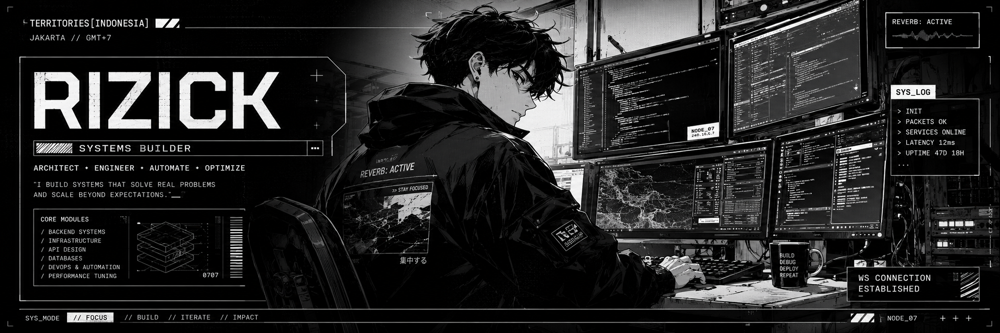

  

  <code>function life() { eat(); code(); sleep(); repeat(); }</code>

  

  <a href="https://rizick-portfolio.vercel.app/">Portfolio</a>
  ·
  <a href="https://github.com/Zee7X">GitHub</a>

---

  
  &nbsp;&nbsp;&nbsp;&nbsp;
  

